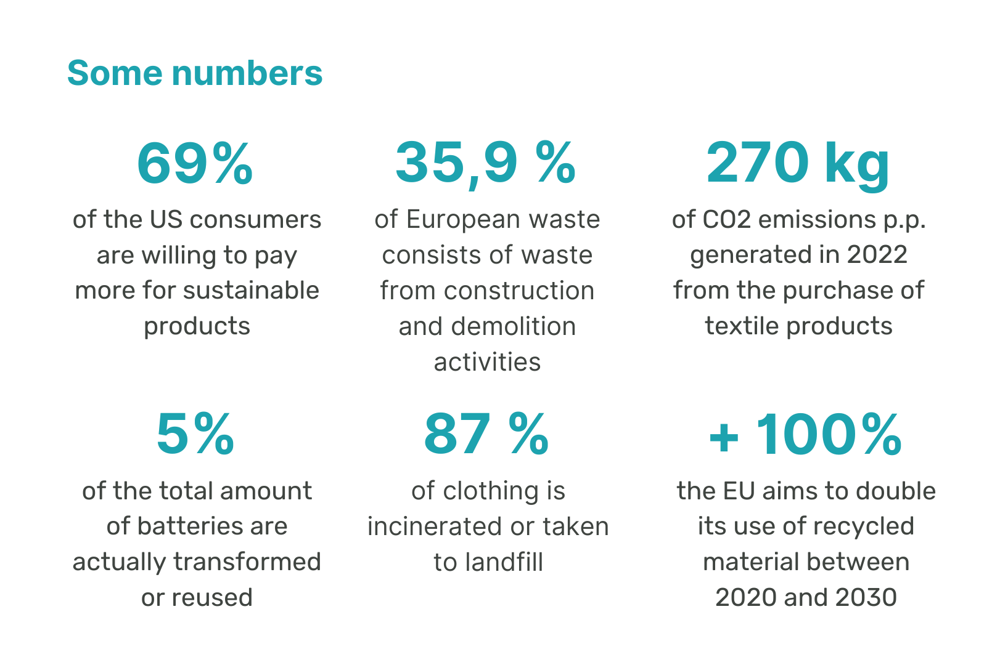
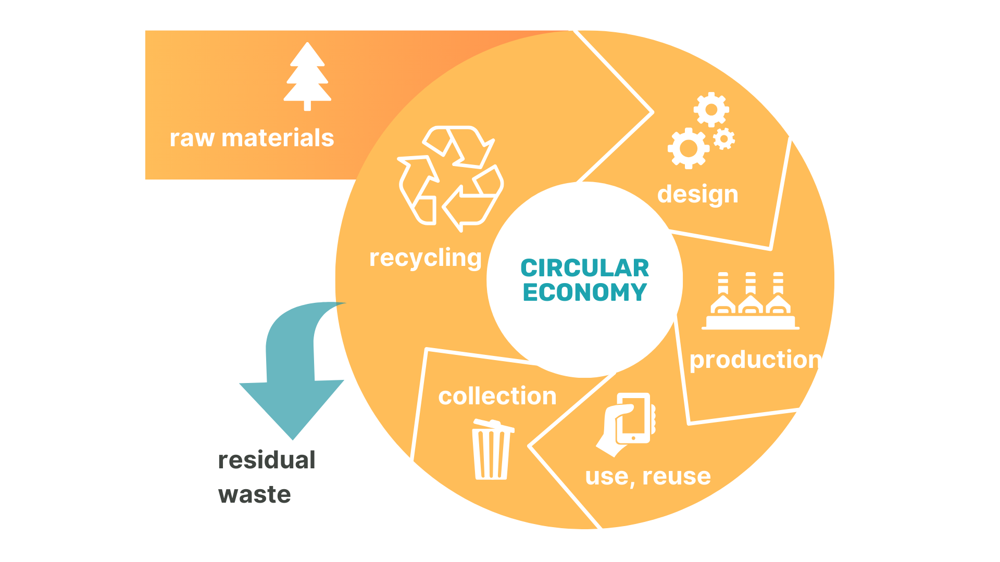
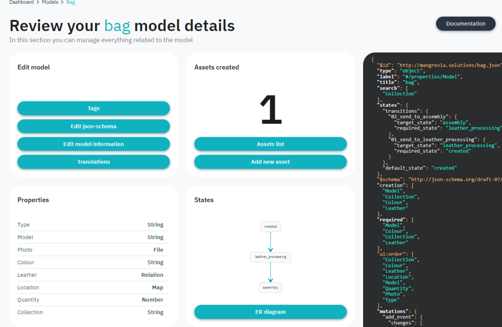
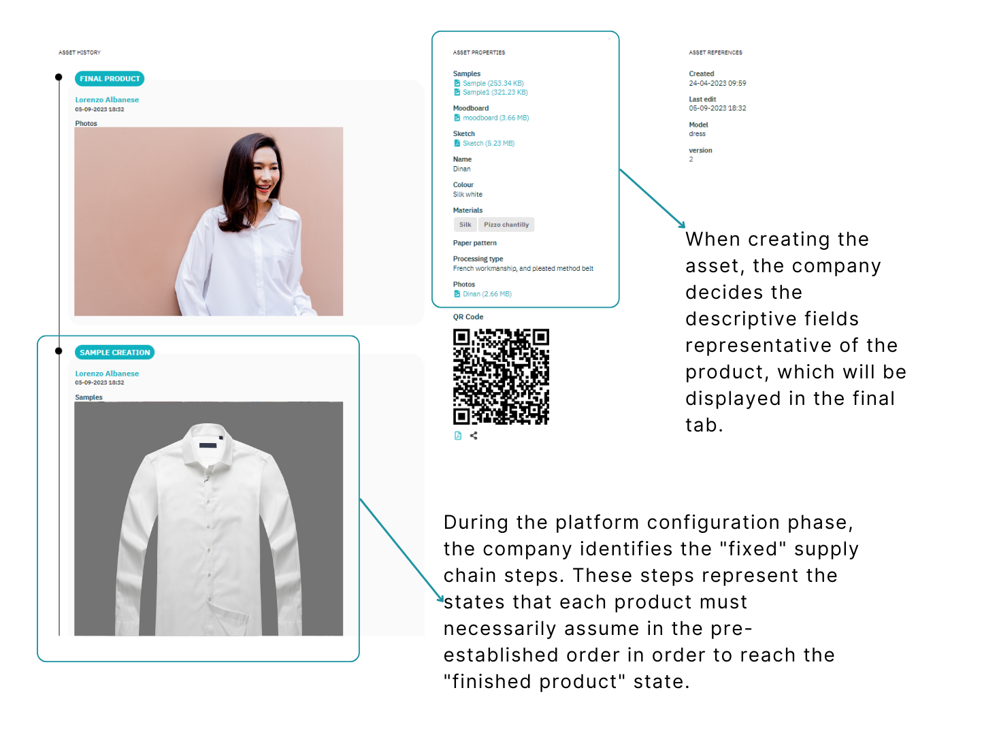
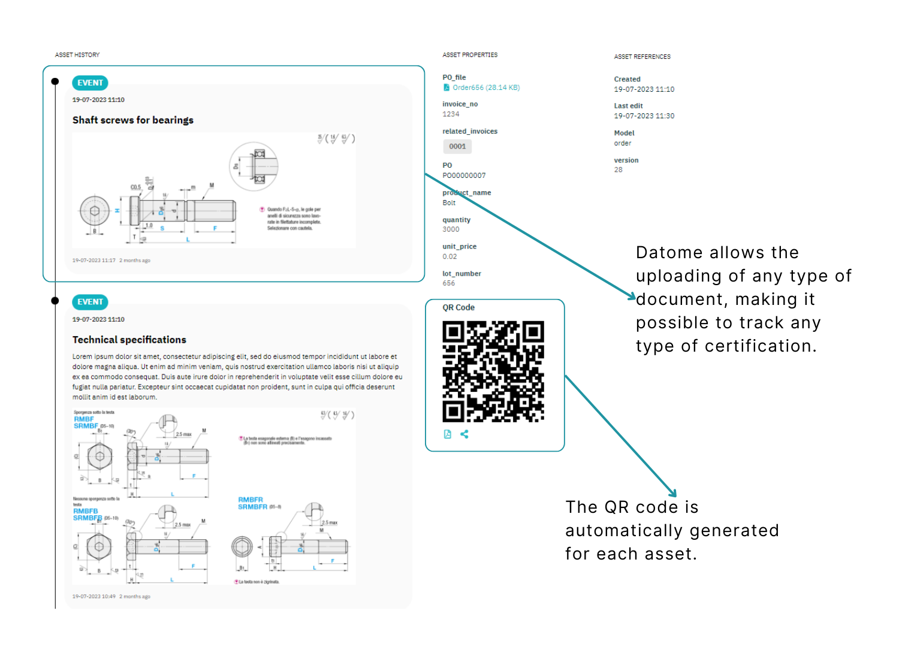
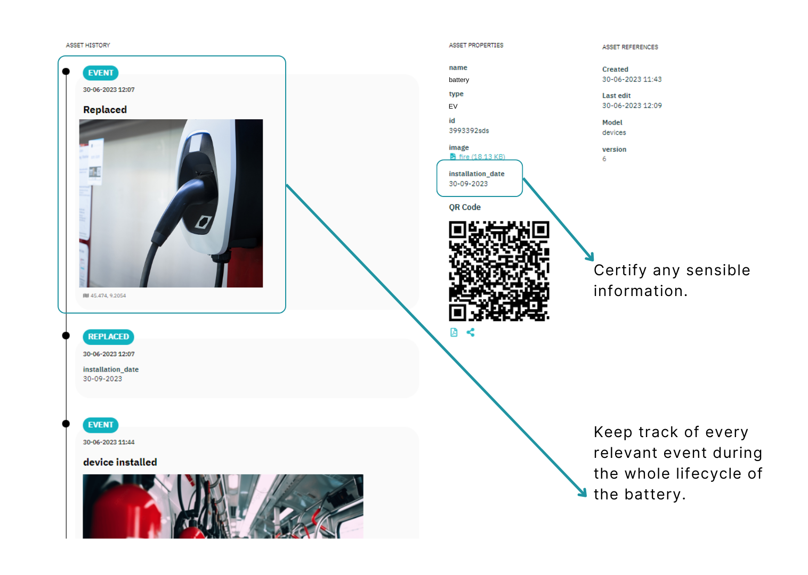

### CONTEXT

The concept of the circular economy represents a transformative shift in our approach to resource management and environmental sustainability.

In practical terms, the circular economy operates through a series of key strategies, including maintenance, reuse, recycling, and composting. By prioritizing these strategies, products and materials are retained within the economic ecosystem for as long as possible.

The European Union has been a pioneering force in advancing the principles of the circular economy, with a central focus on three guiding principles:

- Eliminate waste and pollution: this principle encourages businesses and industries to design products with a focus on longevity and sustainability.

- Circulate products and materials: through strategies like remanufacturing, refurbishment, and repurposing, products are given a new life, reducing the demand for new resources.

- Regenerate nature: the circular economy envisions a world where the exploitation of natural resources is balanced by ecosystem restoration efforts, ensuring that our activities do not degrade the environment but actively contribute to its renewal.

This commitment to the principles of the circular economy is precisely why the European Union is introducing the Digital Product Passport, as a groundbreaking initiative to foster transparency, traceability, and sustainability across the lifecycle of products.

### CONSUMERS NOWADAYS

Today's consumers are making more responsible choices showing a clear preference for brands that commit and prioritize sustainability.

This shift reflects an awareness of environmental and social issues, prompting consumers to prefer companies that align with their values and actively contribute to a more sustainable future. This includes supporting initiatives that extend a product's lifespan and promote the reutilization of end-of-life items.

This evolving consumer behavior is reshaping the marketplace, encouraging businesses to adopt eco-friendly practices to meet the growing demand for sustainable products and services.

### WHAT IS THE DIGITAL PRODUCT PASSPORT?

To achieve a fully circular economy based on sustainability, climate-neutrality and resource-efficiency, the EU has introduced the Digital Product Passport.

The DPP serves as a digital repository of a product's data, enabling the complete traceability and streamlining end-of-life processes by providing clear disposal options.

**Digital Product Passport's goal:**
The EU Digital Product Passport will provide accessible information to both consumers and businesses regarding the product’s environmental sustainability and its transparency within the supply chain, with the aim of increasing its lifespan.

**How will the Digital Product Passport be introduced?:**
By simply scanning a product’s QR code (or RFID) you can access any information about the origin, material composition, repair and disassembly options as well as how the various components can be recycled.

### INDUSTRIES

From 2025, in the EU it will be mandatory for all products to have a Digital Product Passport. This Passport will include detailed sustainability data and aims to promote transparency, traceability and authentication practices across different industries, benefiting both businesses and consumers in the European market. The currently involed industries are textiles, constructions and EV batteries.

**Textile**

- Supply Chain transparency
- Sustainable practices
- Full traceability
- Establish a trustworthy record of a product's composition and environmental impact
- Help consumers to make sustainable choices

**Construction**

- Waste Management plans
- Waste Recycling
- Environmental Compliancy
- Reduce Emissions
- Build Design Certifications
- Track disposables

**EV batteries**

- Achieve CO₂ neutrality
- ‍Track the origin of components and raw materials
- Ensure total compliance with the EU Battery Regulation
- Reduce product carbon footprint
- Ensure trustworthy data from your suppliers
- Avoid potential fines

### DATOME

Integrating Datome, a blockchain-based business process manager, into the European Digital Product Passport (DPP) framework can bring several benefits by easing the management of production processes and availability of the relevant data by stakeholders.
This integration can make the DPP a very powerful tool for promoting transparency, sustainability and trust in product information within the EU market while supporting the goals of the European Green Deal and circular economy initiatives by providing better and immutable insights into the lifecycle of products.

Datome can help structure the vast amount of data within the DPP, ensuring that product-related information is organized, standardized and easily accessible, while flagging inconsistencies or errors in the data, prompting users to correct them before they are added to the DPP. This minimizes the risk of incorrect or misleading information being associated with a product.

## TEXTILE

Datome’s DPP is used within the Textile industry to collect and aggregate reliable data on materials and provide it to customers, auditors, and regulators, while protecting data privacy and confidentially.

**Challenges**

- Suppliers reliability
- Trustworthy carbon footprint analysis
- Low-quality components
- Fulfill customer and regulatory demands while safeguarding sensitive details

**DPP Benefits**

- Improved quality control
- Access to materials composition and origins
- Reducing risk of recalls
- Streamline communication of your material data

## CONSTRUCTIONS

Utilize Digital Product Passports to track materials throughout the supply chain, establishing a trustworthy record of building composition and carbon footprint. Share this data selectively with customers, regulators, and suppliers to ensure compliant construction practices.

**Challenges**

- Materials traceability
- Data & information sharing across many separate entities
- Meeting Compliance Requirements

**DPP Benefits**

- Track Environmental Impact
- Evaluate the effects of material sourcing, emissions during the construction process and the long-term impact of buildings.
- Incorporate information on recycled content to create comprehensive building renovation passports

## EV BATTERIES

Leverage Datome’s powerful blockchain traceability platform to drive sustainable, responsible and circular EV battery value chains.

**Challenges**

- Necessity to capture and share data on the material provenance, the battery’s chemical composition, manufacturing history
- Need to measure the sustainability performance

**DPP Benefits**

- Scalable battery passport system
- Consolidated regulation and due diligence reporting

## CONCLUSIONS

The Digital Product Passport will drive a profound shift in our approach to commerce, sustainability, and responsible consumption. It stands not merely as a tool but as a symbol of our commitment to a more transparent, ethical, and regenerative future.

With the Digital Product Passport, we have the opportunity to empower consumers to make informed choices, fostering a culture of responsible consumption. It streamlines supply chains, reducing inefficiencies, minimizing fraud, and optimizing logistics, resulting in cost savings for businesses while reducing their environmental footprint.

This initiative transcends borders, inviting international collaboration on the path toward a more circular and sustainable global economy. It is not just about reducing our environmental impact; it's about actively regenerating nature through every product we create and consume.

However, it's important to acknowledge the challenges that lie ahead, from data security concerns to the need for standardization. Overcoming these obstacles will require collective effort and innovation, but the potential rewards for businesses and industries are boundless.

Together, we can forge a more sustainable, ethical, and prosperous future for all.
