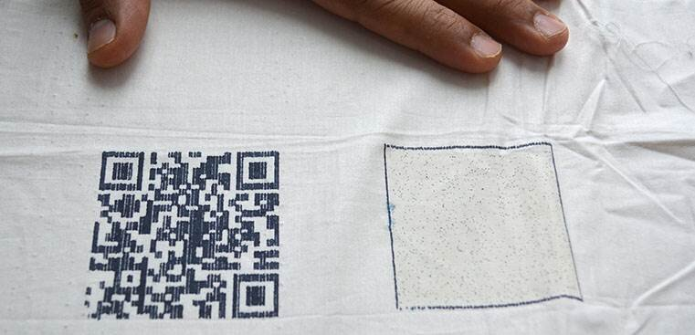

One of the applications of Datome in the textile sector is the certification project for supply chains, aiming to ensure regulatory compliance, particularly concerning the materials used, and to enhance transparency towards consumers.

### SCOPE

Managing the procurement and processing of materials through a unified platform for sustainability information tracking. Datome serves as a tool for mapping supply chains and sustainability information (certifications, origins, quantities), acting as an aggregator between the company, suppliers, and regulatory bodies to facilitate data collection necessary for the transparency of a raw material or product.

### CONTEXT

Company X manufactures high-quality leather products using foreign-sourced raw materials and outsourcing their processing.

### PROCESS OVERVIEW

1. Company X places an order for qty X of leather, communicating the order to the supplier.
2. The supplier accesses Datome and creates a "Leather" asset, inputting the required data (e.g., certification, production date, type, quantity). Once the asset is generated, the supplier downloads the associated QR code, attaches it to the order, and marks it as "sent." In case of a third-party lot inspection request, scanning the QR code provides access to the product sheet with necessary information.
3. Upon receiving the leather lot, Company X logs into Datome and marks it as "In stock."
4. Using the leather lots in stock, Company X requests processing of a specific quantity from a third-party processor.
5. Upon receiving the request, the third-party processor logs into Datome and updates the status of the assigned lots from "In stock" to "In processing," completing the sheet with all required information (e.g., processing type, processing date, ingredients, certifications).
6. After completing the processing, the third-party processor marks the assigned leather lots as "completed."
7. Company X has visibility, through the list of "leather" type assets, into all ordered, in-stock, in-processing, and completed materials.
8. When Company X initiates production of a finished product (e.g., bag), a new "Bag" asset is created on Datome, linked to the leather/leathers that will be used. In addition to information about the raw material used, the product sheet can include additional details, such as the number of pieces produced or the production location.
9. Each bag in the lot is accompanied by a QR code linked to the respective lot, providing access to lot information and cascading to details regarding the leather used.

The unique nature of the processing for various materials necessitates an adaptation of the entire configuration and supply chain management process. Datome easily meets this requirement by allowing customizable mapping of processes, accommodating any supply chain specifics.
